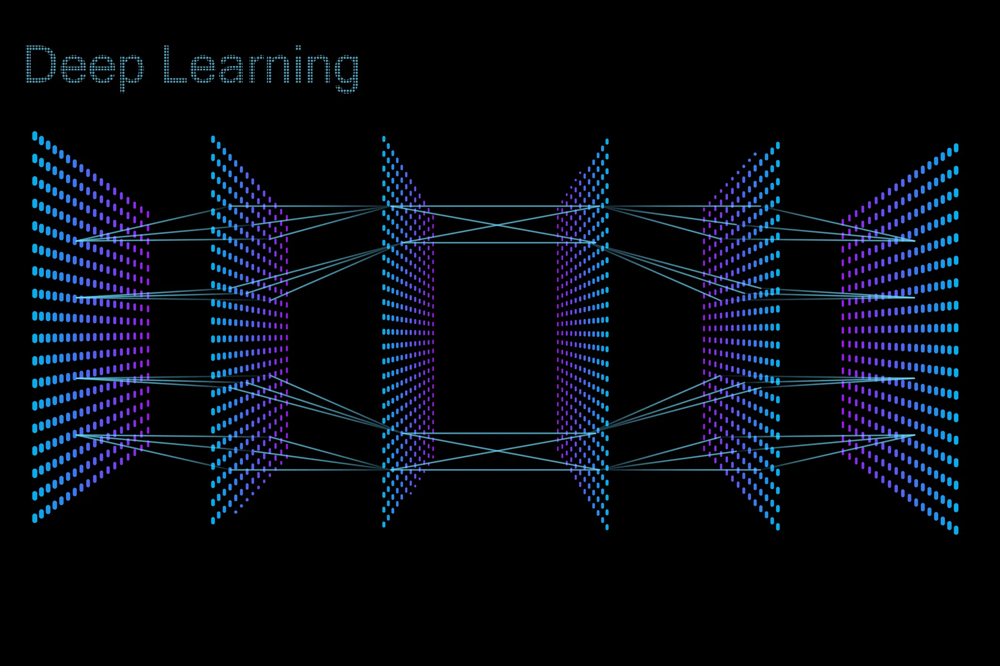

# Deep Learning-in-1-day

	

Welcome to Deep Learning-in-1-day.  Here you will learn about advanced CNNs, RNNs, GANs and Transformers in just a few Jupyter Notebooks!  From there you can extend these tools to other datasets and applications.