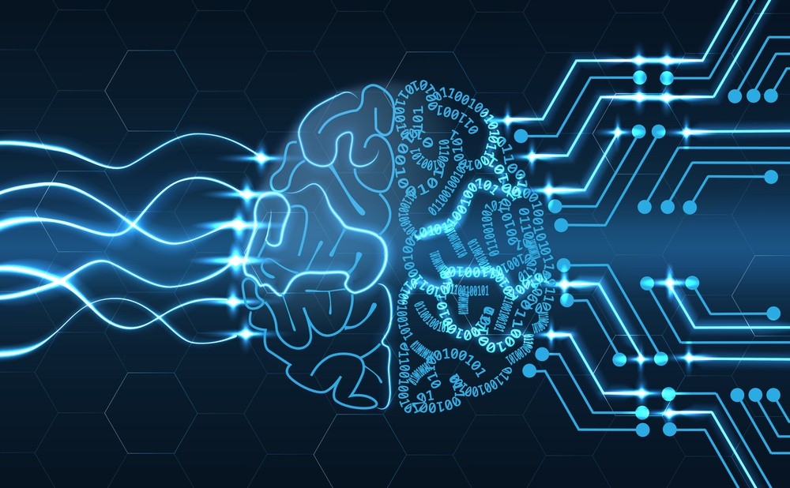

# Machine Learning-in-1-day

	

Welcome to Machine Learning-in-1-day.  Here you will learn about the basics of machine learning, and then apply these to popular machine learning algorithms and libraries, e.g. k-Means, Decision Trees and Random Forest, Naive Bayes, Linear Regression, Kernel Density Esitmation and Support Vector Machines. From there you can extend these tools to other datasets and applications in machine learning.